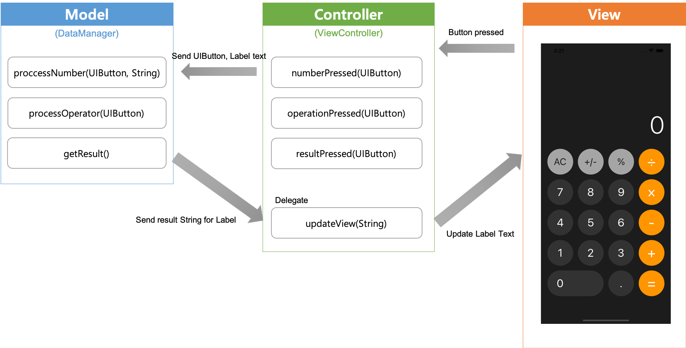

# iOS-Calculator
Clone project of iOS default calculator app

</img>
</img>
</img>
  

## MVC
</img>

This project is developed using Model(DataManager)-View-Controller(ViewController) pattern
  

## Extension
</img>

Used [Extension](https://docs.swift.org/swift-book/LanguageGuide/Extensions.html) for cleaner code. You can check code without extension from [here](https://github.com/ChoiysApple/iOS-Calculator/blob/6c2fc192a209fba09f9e11238b07b167f1a0af2b/iOS-Calculator/iOS-Calculator/ViewController.swift) 
